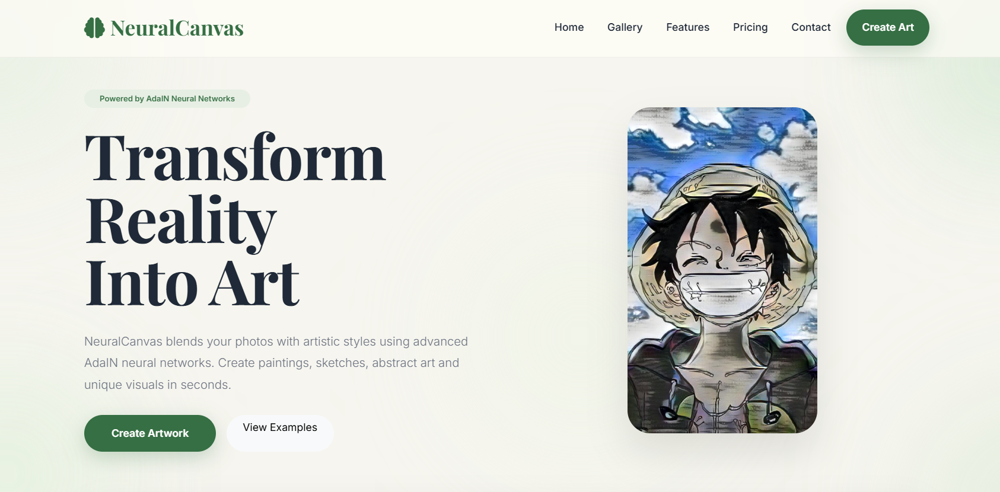
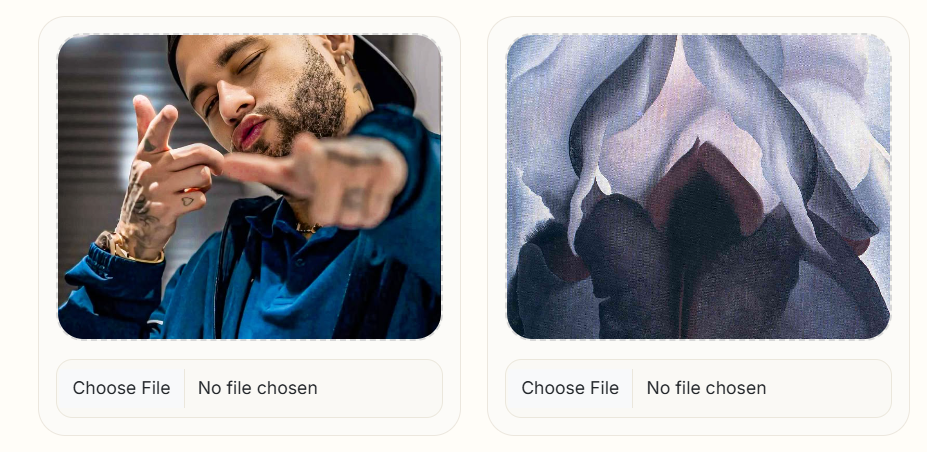
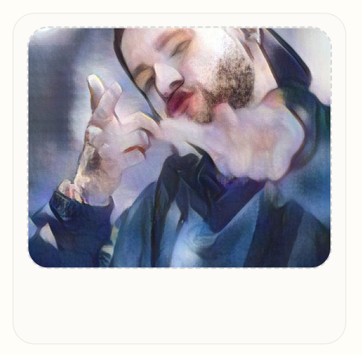

# 🧠 NeuralCanvas

Transform Reality Into Art with AI

NeuralCanvas is an AI-powered artistic style transfer platform that uses Adaptive Instance Normalization (AdaIN) to blend the content of one image with the artistic style of another. Upload a content image, choose a style reference, and generate unique AI artwork in seconds.

---

## 🚀 Live Demo

https://neuralcanvas-cpk1.onrender.com

---

## ✨ Features

✓ AI-powered neural style transfer  
✓ Upload content and style images  
✓ Adjustable style intensity control  
✓ Instant image preview  
✓ Download generated artwork  
✓ Example showcase gallery  
✓ Clean responsive UI  
✓ Flask + PyTorch backend

---

## 🖼 Workflow

```text
Content Image
      ↓
Style Image
      ↓
AdaIN Neural Network
      ↓
AI Generated Artwork
```

---

## 📸 Screenshots

### Homepage



### Upload Studio



### Generated Artwork



---

## 🛠 Tech Stack

### Frontend

- HTML
- CSS
- Bootstrap
- JavaScript

### Backend

- Flask
- Flask-WTF
- Gunicorn

### AI / Machine Learning

- PyTorch
- AdaIN
- VGG Encoder
- Decoder Network

---

## 📁 Project Structure

```text
NeuralCanvas/
│
├── app.py
├── templates/
├── static/
├── content_data/
├── style_data/
├── experiment/
│   └── big_dataset/
├── utils/
├── requirements.txt
├── Procfile
└── README.md
```

---

## ⚙ Installation

Clone repository:

```bash
git clone https://github.com/itsakki10/NeuralCanvas.git
```

Move into project:

```bash
cd NeuralCanvas
```

Create virtual environment:

```bash
python -m venv env
```

Activate environment:

Windows:

```bash
env\Scripts\activate
```

Install dependencies:

```bash
pip install -r requirements.txt
```

Run application:

```bash
python app.py
```

Open:

```text
http://localhost:5000
```

---

## 👨‍💻 Author

Akash Mehra

AI & Machine Learning Major Project

GitHub: https://github.com/itsakki10

---
